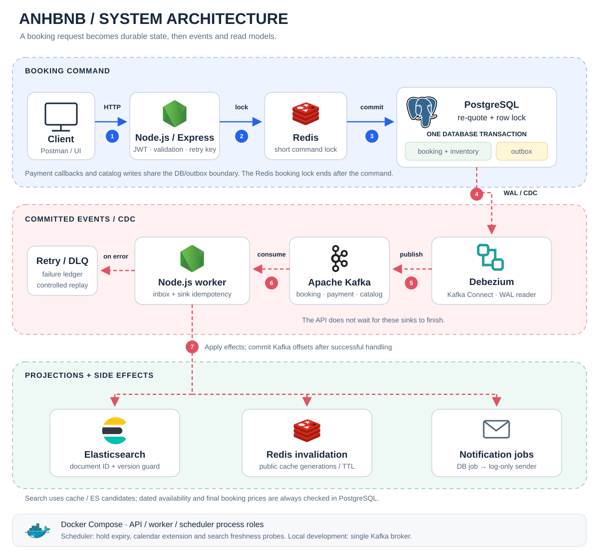
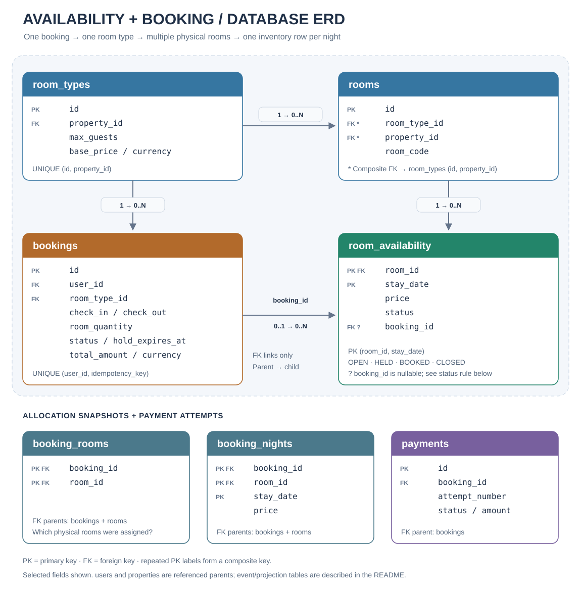

<div align="center">

# Anhbnb

**A lodging-booking backend built for learning and practicing backend engineering.**

Transactional room inventory · Event-driven processing · Search and geospatial discovery

<p>
  
  
  
  
  
  
  
</p>

[Architecture](#system-architecture) · [Database ERD](#database-erd) · [Getting started](#getting-started) · [Testing](#testing-and-verification)

</div>

## Project overview

Anhbnb explores a practical backend problem: **how can concurrent guests reserve the last available rooms while search, cache, and notifications update asynchronously?**

The project starts with a Node.js modular monolith and adds PostgreSQL transactions, Redis coordination, transactional outbox, Debezium CDC, Kafka consumers, and an Elasticsearch read model. API, worker, and scheduler run as separate processes within the same application.

This is a coursework and practice project. The default development flow uses mock payments, log-only notifications, and seeded catalog data.

### Features

| Area                     | What is implemented                                                                                                       |
| ------------------------ | ------------------------------------------------------------------------------------------------------------------------- |
| Accounts                 | Registration/login, bcrypt password hashing, JWT authentication, and ownership checks                                     |
| Catalog and discovery    | Properties, room types, amenities, locations, text filters, geo search, and pagination                                    |
| Availability and booking | Per-room/per-date inventory, multi-room quantity within one room type, timed holds, cancellation, and idempotent checkout |
| Payments                 | Mock payment attempts, duplicate callback handling, expiry, reconciliation, and late-success rules                        |
| Redis                    | Short-lived booking lock, three public caches, rate limiting, and dependency fallback                                     |
| Events                   | Transactional outbox → WAL → Debezium/Kafka Connect → Kafka → idempotent consumers                                        |
| Background work          | Search projection, cache invalidation, notification jobs, retry/DLQ, hold expiry, and calendar extension                  |

## System architecture

[](assets/architecture.svg)

_Click the diagram to view it at full size. Blue arrows are synchronous command steps; red dashed arrows are asynchronous event processing._

| Step | Flow                      | Why it matters                                                                                                               |
| ---- | ------------------------- | ---------------------------------------------------------------------------------------------------------------------------- |
| 1    | Client → Express API      | Authenticate, validate input, apply endpoint rate limits, and inspect the idempotency key.                                   |
| 2    | API → Redis booking lock  | A token-owned lock with TTL and bounded retry reduces contention while the command runs.                                     |
| 3    | PostgreSQL transaction    | Re-quote prices, lock inventory, verify every requested room-night, and commit booking + held inventory + outbox atomically. |
| 4    | PostgreSQL WAL → Debezium | Capture committed outbox inserts through logical replication.                                                                |
| 5    | Kafka Connect → Kafka     | Route domain events into booking, payment, and catalog topics.                                                               |
| 6    | Kafka → worker            | Process events with stable consumer identities, inbox deduplication, retries, and a failure/DLQ ledger.                      |
| 7    | Worker → sinks            | Maintain Elasticsearch documents, invalidate public caches, and create notification jobs for the log-only sender.            |

Payment callbacks and catalog updates use the same PostgreSQL/outbox boundary. The Redis booking lock applies to booking commands; it ends when command processing finishes, while the database hold remains until its state changes or expires.

### Read flow: browse and search

Property details and reference lists use Redis cache-aside with PostgreSQL as their backing store. Elasticsearch search caches discovery results, checks projection freshness, and hydrates returned candidates from canonical catalog data. With stay dates, the API performs a fresh **bulk availability quote from PostgreSQL** before returning results.

At checkout, the booking command re-quotes again. Neither a cart item, a cache hit, nor an Elasticsearch result guarantees that a room is still available or that its displayed price is final.

### Booking, payment, and retries

A booking selects **one room type** and a `roomQuantity` of physical rooms. It initially enters `PENDING_PAYMENT` and holds the selected inventory. A valid successful mock callback confirms the booking and changes held rows to `BOOKED`. The scheduler expires overdue holds and releases eligible inventory.

Late payment success attempts to reclaim the original allocation only when the database state allows it. Otherwise the payment flow flags manual refund/review instead of assigning rooms already taken by another booking.

Kafka events can be redelivered. For PostgreSQL effects, the inbox insert and business change commit in one transaction before the offset is committed. External sinks use their own safeguards: deterministic document IDs and version checks for Elasticsearch, retryable cache invalidation, and durable notification jobs. Exactly-once _effects_ depend on the sink; email delivery without provider idempotency is not promised exactly once.

## Database ERD

[](assets/database-erd.svg)

_Core tables and selected fields are shown. Arrows link referenced parents to referencing children. The supporting allocation and payment tables list their foreign-key parents explicitly._

### How the inventory model works

`room_availability` has a composite primary key **`(room_id, stay_date)`**. Each row describes one physical room on one night:

| Room   | Stay date  | Status | Booking owner |
| ------ | ---------- | ------ | ------------- |
| Room A | 2030-06-10 | OPEN   | null          |
| Room A | 2030-06-11 | HELD   | booking-1     |
| Room B | 2030-06-10 | OPEN   | null          |
| Room B | 2030-06-11 | OPEN   | null          |

In this illustrative example, a stay from June 10 to June 12 occupies two nights. Only Room B is open for the **entire** stay. Counting open rooms independently per date is insufficient: the same physical room must be available throughout the requested interval.

During booking, PostgreSQL locks/rechecks inventory and conditionally changes eligible `OPEN` rows to `HELD`. The affected-row count must equal `roomQuantity × nightCount`; failure rolls back the transaction. The primary key prevents duplicate room-night records, while the transaction and conditional updates prevent competing bookings from taking the same inventory.

| Record              | Purpose                                                                          |
| ------------------- | -------------------------------------------------------------------------------- |
| `room_types`        | Room category, capacity, canonical base price, and property relationship         |
| `rooms`             | Individually bookable physical rooms belonging to a room type                    |
| `room_availability` | Current nightly price, inventory status, and optional booking owner              |
| `bookings`          | User, selected room type, stay dates, quantity, hold deadline, and quoted totals |
| `booking_rooms`     | Physical rooms assigned to the booking                                           |
| `booking_nights`    | Historical price snapshot for each booked physical room and night                |
| `payments`          | Payment attempts and their status for a booking                                  |

The schema requires `OPEN/CLOSED` inventory to have no `booking_id`, and `HELD/BOOKED` inventory to have one. Service transactions keep booking and inventory transitions consistent. Nightly snapshots remain distinct from current availability; there is no FK from `booking_nights` to `room_availability`.

### Event and projection records

| Table(s)                                                                       | Responsibility                                                                                      |
| ------------------------------------------------------------------------------ | --------------------------------------------------------------------------------------------------- |
| `outbox_events`                                                                | Stable `event_id` plus aggregate type/ID/version and event payload, committed with business changes |
| `consumer_inbox`                                                               | Deduplication with primary key `(consumer_name, event_id)`                                          |
| `notification_jobs`, `consumer_failures`                                       | Durable jobs, attempts, unresolved failures, and replay diagnostics                                 |
| `catalog_versions`, `catalog_reference_versions`                               | Catalog revisions and deletion/version history                                                      |
| `search_projection_state`, `search_projection_progress`, `search_rebuild_runs` | Projection generation, freshness, and rebuild progress                                              |

Outbox aggregate IDs and notification event/booking references are logical associations, not database foreign keys. Redis, Kafka, and Elasticsearch are external infrastructure rather than relational tables. See [migrations](migrations/) for the full schema, including users, properties, cart, images, and amenities.

## Repository structure

```text
.
├── src/
│   ├── app.js, server.js        # Express application and API entry point
│   ├── worker.js, scheduler.js # Separate background process entry points
│   ├── modules/               # Auth, catalog, availability, carts, bookings,
│   │                          # payments, events, and search
│   ├── infrastructure/        # Redis, Kafka, search clients, instrumentation
│   ├── runtime/               # Process composition, health, lifecycle
│   ├── workers/               # Notification, cache, and search handlers
│   └── jobs/                  # Scheduled domain jobs
├── migrations/                # PostgreSQL schema evolution
├── seeds/                     # Synthetic catalog and availability data
├── docker/                    # Database, Kafka, CDC, and ES configuration
├── scripts/                   # Setup, diagnostics, maintenance, E2E
├── tests/                     # Unit and integration suites
├── postman/                   # Collection and example local environment
├── assets/                    # Architecture and database diagrams
├── compose.yaml               # Local services and one-off setup tools
└── Dockerfile                 # Development and production build targets
```

## Getting started

### Requirements

- Node.js 22+ and npm. The Docker build pins Node.js 22.23.2; Conda is not required.
- Docker Desktop, or Docker Engine with Compose. Around 8–12 GB of Docker memory is recommended for the full stack.
- Optional: Postman for API testing and DBeaver for inspecting PostgreSQL. Server tools such as `psql` and Kafka CLI can run inside containers.

Run the following from the directory containing `package.json` and `compose.yaml`:

```bash
node --version
docker compose version
npm ci
```

<details>
<summary><strong>First run only: environment, migrations, seed, CDC, and search</strong></summary>

On a fresh checkout, `setup:local` generates private local credentials in `.env.docker` and `.env.phase2`. It refuses to overwrite existing files. No environment files or secrets are shipped in this repository, and no external payment/email credentials are needed for the default mock flow. The Postman environment example contains only localhost settings and empty placeholders, not credentials.

```bash
npm run setup:local

docker compose --env-file .env.docker --profile messaging --profile search \
  up -d postgres redis kafka elasticsearch --wait

docker compose --env-file .env.docker --profile messaging --profile search --profile tools build migrate

docker compose --env-file .env.docker --profile messaging --profile search --profile tools run --rm migrate

# Only on a fresh development database:
docker compose --env-file .env.docker --profile messaging --profile search --profile tools run --rm seed

docker compose --env-file .env.docker --profile messaging --profile search --profile tools run --rm kafka-init
docker compose --env-file .env.docker --profile messaging --profile search --profile tools run --rm cdc-init

docker compose --env-file .env.docker --profile messaging --profile search \
  up -d kafka-connect --wait

docker compose --env-file .env.docker --profile messaging --profile search --profile tools run --rm connector-init
docker compose --env-file .env.docker --profile messaging --profile search --profile tools run --rm search-init

ENV_FILE=.env.phase2 npm run catalog:repair
```

These steps initialize durable state. Routine startup does not repeat seeding, connector registration, or catalog repair. Keep local credentials out of Git.

</details>

### Start or resume the application

```bash
SEARCH_BACKEND=es SEARCH_PROBES_ENABLED=true WORKER_HANDLERS=notification,cache,search \
docker compose --env-file .env.docker --profile app --profile messaging --profile search \
  up -d --build --wait postgres redis kafka kafka-connect elasticsearch api worker scheduler

curl http://localhost:3000/health/ready
ENV_FILE=.env.phase2 npm run cdc:check
```

Search may briefly wait for fresh CDC probes after startup. API readiness alone does not prove the search projection is current.

| Service       | Host address                                   | Container address    |
| ------------- | ---------------------------------------------- | -------------------- |
| REST API      | `http://localhost:3000/api/v1`                 | `api:3000`           |
| PostgreSQL    | `localhost:5433`, database `hotel_booking_dev` | `postgres:5432`      |
| Redis         | `localhost:6379`                               | `redis:6379`         |
| Kafka         | `localhost:9092`                               | `kafka:29092`        |
| Kafka Connect | `http://localhost:8083`                        | `kafka-connect:8083` |
| Elasticsearch | `http://localhost:9200`                        | `elasticsearch:9200` |

Import the [Postman collection](postman/Hotel-Booking.postman_collection.json) and [example environment](postman/Local.postman_environment.json.example). Set `baseUrl=http://localhost:3000` and `searchEnabled=true` to exercise ES geo search. The collection creates test bookings in the target database.

To stop the stack while preserving data:

```bash
docker compose --env-file .env.docker --profile app --profile messaging --profile search stop
```

Use `up` to resume; migrations and seed are not required every time. **`down -v` deletes persistent volumes.** Back up any data you need before resetting the stack.

### Node-on-host development

Keep PostgreSQL, Redis, Kafka, Kafka Connect, and Elasticsearch running in Compose. Stop the containerized application processes before starting their local counterparts so the API port and scheduler do not conflict:

```bash
docker compose --env-file .env.docker --profile app stop api worker scheduler

# Run each command in its own terminal:
ENV_FILE=.env.phase2 SEARCH_BACKEND=es SEARCH_PROBES_ENABLED=true npm run dev
ENV_FILE=.env.phase2 WORKER_HANDLERS=notification,cache,search npm run worker:dev
ENV_FILE=.env.phase2 SEARCH_PROBES_ENABLED=true npm run scheduler:dev
```

Inspect container state with `docker compose --env-file .env.docker --profile app --profile messaging --profile search ps`, and follow a service with `docker compose --env-file .env.docker --profile app logs -f api` (replace `api` with another service name). Host processes use `localhost` endpoints from `.env.phase2`; containers use Compose service hostnames. Do not interchange the two environments.

## Testing and verification

| Command                                       | Checks                                                                 |
| --------------------------------------------- | ---------------------------------------------------------------------- |
| `npm test`                                    | Unit tests                                                             |
| `ENV_FILE=.env.phase2 npm run test:all`       | Main regression suite; Kafka/ES opt-in tests run separately            |
| `ENV_FILE=.env.phase2 npm run test:kafka`     | Kafka consumer integration                                             |
| `ENV_FILE=.env.phase2 npm run test:search`    | Search and geospatial integration                                      |
| `ENV_FILE=.env.phase2 npm run test:reindex`   | Projection rebuild and alias cutover                                   |
| `ENV_FILE=.env.phase2 npm run cdc:check`      | Connector/task status and replication slot                             |
| `ENV_FILE=.env.phase2 npm run events:inspect` | Outbox, inbox, jobs, and unresolved failures                           |
| `npm run test:compose`                        | Isolated full-stack bootstrap, mock checkout, CDC, sinks, and recovery |

Integration suites need their dependencies running and a migrated test database; run DB suites sequentially. The full Compose test creates an isolated UUID project and deletes only its own test resources afterward.

The Compose E2E checks mock checkout and callback retries, outbox/CDC delivery, consumer restart, catalog projection, Redis fallback, and PostgreSQL outage/recovery. Run it against your own Docker environment to verify the stack rather than treating a previous run as a guarantee.

## Current scope

The application is a modular monolith with separate process roles. Payment defaults to mock and notifications are log-only. Prices remain fixed/seeded; a booking still contains one room type. Compose uses a single Kafka broker and local service settings; production deployment and high availability are outside the current learning scope.

### Visual references

The architecture layout is inspired by [NYC Taxi Data Pipeline](https://github.com/trannhatnguyen2/NYC_Taxi_Data_Pipeline): tool logos, numbered arrows, and grouped processing areas. Anhbnb's flows and SVG drawings are specific to this repository. Embedded tool icons come from [Devicon](https://github.com/devicons/devicon), under its MIT license; the icon license is retained in the architecture SVG.
